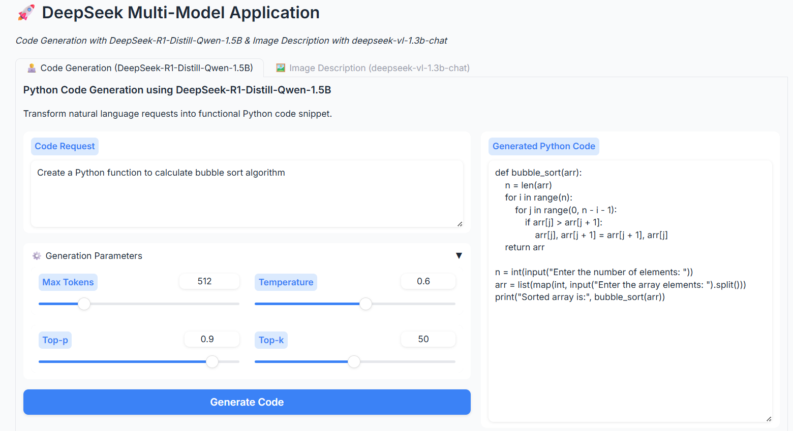
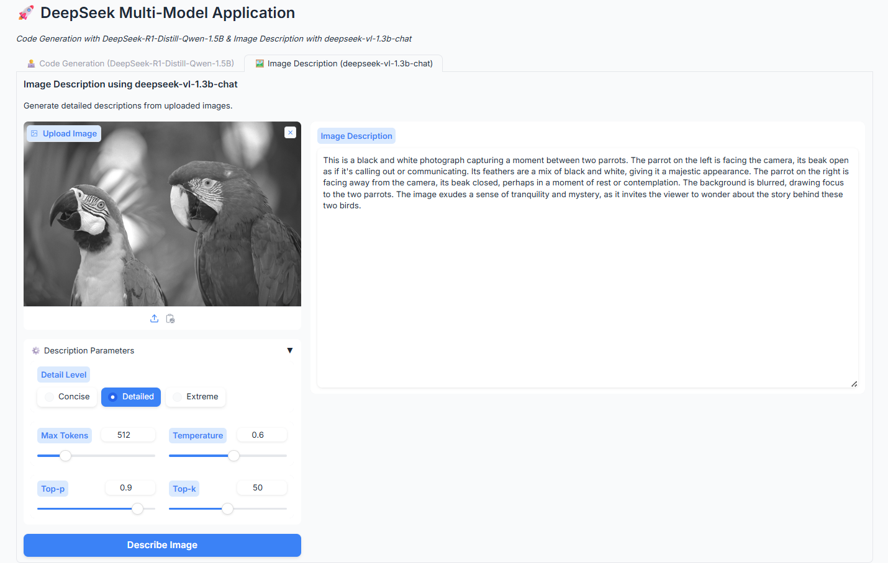

# 🚀 DeepSeek Multi-Task Application 🚀

## 🔍 Overview
This repository contains a Gradio-based application that leverages two DeepSeek models to provide:
1. **Code Generation**: Generates Python code snippets from natural language prompts using the `DeepSeek-R1-Distill-Qwen-1.5B` model.
2. **Image Description**: Produces detailed textual descriptions of uploaded images using the `deepseek-vl-1.3b-chat` model.

The application is designed to be user-friendly, featuring adjustable parameters for fine-tuning output creativity and coherence.

---

## 📋 Table of Contents
1. [Features](#features)
2. [Prerequisites](#prerequisites)
3. [Installation & Setup](#installation--setup)
4. [Usage](#usage)
   - [Launching the App](#launching-the-app)
   - [Code Generation Tab](#code-generation-tab)
   - [Image Description Tab](#image-description-tab)
5. [Examples](#examples)
6. [Prompt Engineering Strategies](#prompt-engineering-strategies)
7. [Parameter Choices & Their Effects](#parameter-choices--their-effects)
8. [Contributing](#contributing)
9. [License](#license)

---

## 🌟 Features
- **Interactive Gradio Interface**: Two tabs—one for code generation and one for image description—each with adjustable parameters.
- **Pretrained Models**:
   - **Code Model**: [`deepseek-ai/DeepSeek-R1-Distill-Qwen-1.5B`](https://huggingface.co/deepseek-ai/DeepSeek-R1-Distill-Qwen-1.5B) for high-quality Python code generation and reasoning capabilities [](https://huggingface.co/deepseek-ai/DeepSeek-R1-Distill-Qwen-1.5B).   
   - **Vision-Language Model**: [`deepseek-ai/deepseek-vl-1.3b-chat`](https://huggingface.co/deepseek-ai/deepseek-vl-1.3b-chat) for detailed image descriptions and multimodal tasks [](https://huggingface.co/deepseek-ai/deepseek-vl-1.3b-chat).   
- **Prompt Examples**: Built-in examples that guide each model to produce coherent, relevant outputs.
- **Parameter Tuning**: Sliders for `max_new_tokens`, `temperature`, `top_p`, and `top_k` allow you to control output length and creativity.
- **Responsive GPU Support**: Automatically moves models to GPU (CUDA) when available for faster inference.

---

## 📦 Prerequisites
- **Python Version**: ≥ 3.8
- **CUDA**: If using GPU acceleration, ensure CUDA is installed (≥ 11.6 for PyTorch compatibility).
- **Virtual Environment (Recommended)**: It is recommended to create a virtual environment to isolate dependencies.

### 🖥️ Hardware Recommendations
- **GPU**: NVIDIA GPU with ≥ 12GB VRAM (e.g., T4, A100, RTX A6000) for smooth inference.
- **CPU**: A modern multi-core CPU if GPU is unavailable (inference will be slower).

---

## 🛠️ Installation & Setup

1. **Clone the repository**:
   ```bash
   git clone https://github.com/ahmed-eladl/deepseek-multi-task-app.git
   cd deepseek-multi-task-app
   ```

2. **Create and activate a virtual environment**:
   ```bash
   python3 -m venv venv
   source venv/bin/activate      # Linux/macOS
   venv\Scripts\activate       # Windows
   ```

3. **Install dependencies**:
   Ensure `pip` is up to date:
   ```bash
   pip install --upgrade pip
   ```
   Install required packages:
   ```bash
   pip install torch torchvision torchaudio         # PyTorch
   pip install transformers                         # Hugging Face Transformers
   pip install gradio                                # Gradio for UI
   pip install deepseek-vl                            # DeepSeek vision-language utilities
   ```
> **Note:** If you encounter any issues installing `deepseek-vl`, you can follow the installation instructions here:  
> https://github.com/deepseek-ai/DeepSeek-VL


4. **Verify GPU availability** (optional):
   
   ```python
   import torch
   print(torch.cuda.is_available())  # Should return True if GPU is accessible
   ```

---

## 📝 Usage

### 🚀 Launching the App
Run the main Python script to start the Gradio application:
```bash
python app.py
```
- The application will launch locally at `http://localhost:7860/` by default.
<!-- - To make it publicly accessible, use the `share=True` flag in `app.launch()`, which generates a publicly shareable URL (e.g., https://xyz.gradio.app). -->
- If you’d like to share your app publicly (Gradio’s tunnel), run:  
   ```bash
   python app.py --share
   ```
   A public URL (e.g., `https://xyz.gradio.app`) will be generated.  
---

### 🧑‍💻 Code Generation Tab
1. **Navigate to the "🧑‍💻 Code Generation" tab**.
2. **Prompt Input**:
   - Enter prompt request for a Python code snippet.  
     Example placeholder:  
     ```
     Create a Python function to calculate factorial of a number using recursion.
     ```
3. **Generation Parameters**:
   - **Max Tokens** (`max_new_tokens`): Maximum number of tokens the model will generate. Default: 512.
   - **Temperature** (`temperature`): Controls randomness and creativity (0.1–1.0). Lower values → more deterministic output.
   - **Top-p** (`top_p`): Nucleus sampling threshold (0.1–1.0). The model samples from the smallest possible set of tokens with cumulative probability ≥ `top_p`.
   - **Top-k** (`top_k`): Only consider the top `k` highest-probability tokens at each step.
4. **Generate Code**:
   - Click **Generate Code**. The generated Python snippet will appear in the output textbox.
   - The code is cleaned to remove system prompts, code fences, and special tokens.

---

### 🖼️ Image Description Tab
1. **Navigate to the "🖼️ Image Description" tab**.
2. **Upload Image**:
   - Click **Upload Image** to select an image from your local machine or use the clipboard.
3. **Description Parameters**:
   - **Detail Level**: Choose among:
     - **Concise**: High-level summary of the image.
     - **Detailed**: Paragraph-style description with visible objects, context, and interactions.
     - **Extreme**: Exhaustive listing of every visible detail.
   - **Max Tokens** (`max_new_tokens`): Default: 512.
   - **Temperature**, **Top-p**, **Top-k**: Same definitions as above. Adjust to control creativity vs. accuracy.
4. **Describe Image**:
   - Click **Describe Image**. The description will appear in the output textbox.

---

## 💡 Examples

### Code Generation Example
  

### Image Description Example
  
---

## 🧠 Prompt Engineering Strategies

### 1. System Messages & Role Conditioning (Code Generation)
- **System Role Specification**: We explicitly define the model's role as a "code-generation AI." This orients the model toward returning only executable Python code.
- **Instruction Clarity**: The system message instructs:  
  > "You are a code-generation AI. When given a prompt, you must return only the Python code snippet that fulfills the request. Do NOT include any explanations, JSON schemas, commentary, or special tokens."
- **Priming with Examples**: We include a prior user–assistant exchange (e.g., Fibonacci example).  
  - This **“few-shot”** style provides the model with a clear pattern:  
    1. **User**: “Generate a Python code snippet that fulfills this request: …”  
    2. **Assistant**: [Python code snippet].  
  - By showing how the assistant responds, the model learns to mimic that format for new prompts.
- **Cleaning Layer**: After generation, we use `clean_generated_output()` to strip away any residual instructions, special tokens, or code fences.

### 2. Prompt Structure (Image Description)
- **Detail Level Prompting**: We define three levels—Concise, Detailed, Extreme—to guide the granularity of the description.  
  - The “User” message is:  
    ```
    <image_placeholder> [Detail Prompt]
    ```  
  - Example for Detailed:  
    ```
    <image_placeholder> Describe an image in detail.
    ```
- **Conversation Formatting**: We frame input as a two-message conversation:  
  1. User: containing image placeholder + directive.  
  2. Assistant: empty content where the model will generate a description.
- **Force Batchify**: Ensures consistent processing whether one image or multiple images are provided.

---

## 🎛️ Parameter Choices & Their Effects

Adjustable parameters give you control over the model’s creativity, output length, and sampling behavior:

1. **max_new_tokens**:
   - Defines the maximum number of tokens to be generated.  
   - **Typical Ranges**:
     - Code Generation: 256–1024 (depending on expected snippet length).
     - Image Description: 128–512 (longer descriptions for “Extreme”).
   - **Effect**: Larger values allow longer outputs but may increase inference time and cost.

2. **temperature (0.1–1.0)**:
   - Controls randomness:  
     - **Low (0.1–0.3)**: Outputs become more deterministic, sticking to high-probability tokens—ideal for precise code generation.  
     - **Medium (0.4–0.7)**: Balances creativity and coherence—good for descriptive tasks.  
     - **High (0.8–1.0)**: More randomness—potentially more creative but may generate irrelevant or redundant content.

3. **top_p (0.1–1.0)**:
   - **Nucleus Sampling**: The model considers only the smallest set of tokens whose cumulative probability ≥ `top_p`.  
   - **Lower `top_p` (0.1–0.5)**: Restricts to highest probability tokens—more conservative output.  
   - **Higher `top_p` (0.8–1.0)**: Includes broader token set—encourages creative or “out-of-the-box” phrases.

4. **top_k (1–100)**:
   - **Top-K Sampling**: Only the top `k` highest-probability tokens are considered at each generation step.  
   - **Lower `k` (1–10)**: Very conservative—model picks from very limited options.  
   - **Higher `k` (50–100)**: More variety—can help when generating narrative or descriptive text (e.g., “Detailed” – “Extreme” levels).

### Guidelines for Parameter Tuning
- **Code Generation**:
  - **Use Lower `temperature` (0.1–0.4)** and **`top_p` ≈ 0.9**, **`top_k` ≈ 10–50** for concise, correct snippets.
  - **Increase `max_new_tokens`** when expecting longer utility functions or multi-function scripts.
- **Image Description**:
  - **Temperature (0.4–0.7)** and **`top_p` (0.9–1.0)** work well for natural, varied descriptions.
  - **Adjust `detail_level`** based on desired verbosity.  
    - **Concise**: shorter token limit (128–256).  
    - **Detailed / Extreme**: higher token limit (512+).

---

## 🤝 Contributing
Contributions, issues, and feature requests are welcome!  
1. Fork the repository.  
2. Create a new branch: `git checkout -b feature/your-feature`.  
3. Commit your changes: `git commit -m "Add new feature"`.  
4. Push to the branch: `git push origin feature/your-feature`.  
5. Open a Pull Request describing your changes.

---

## 📄 License
This project is licensed under the MIT License. See the [LICENSE](LICENSE) file for details.
